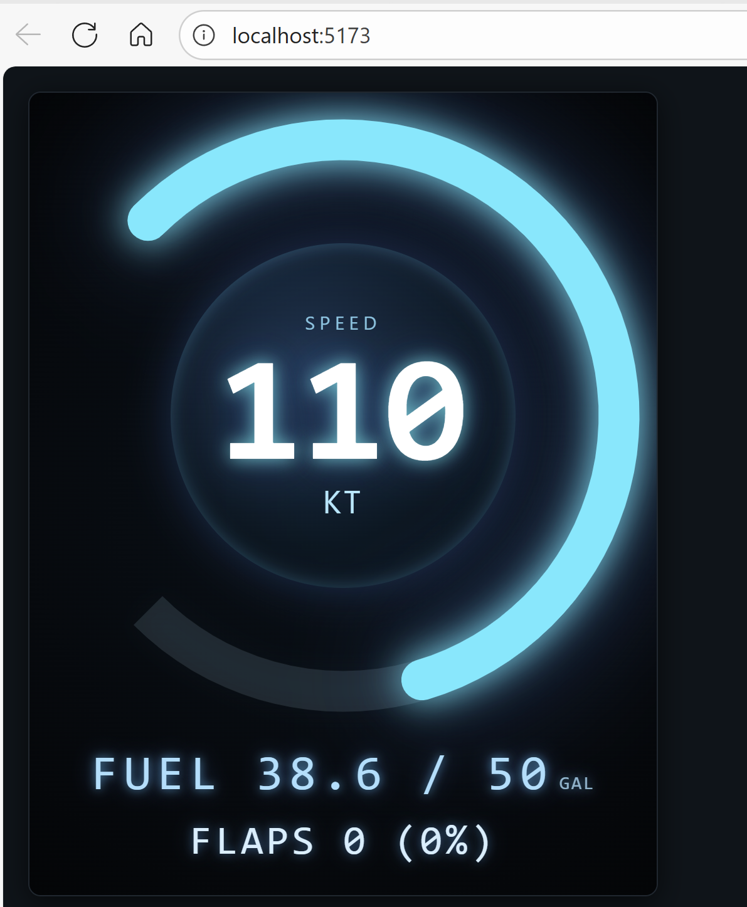

# My Avionics Web Host

A lightweight Express server to preview `MyInstrument.html` in a regular browser outside MSFS. It provides a way to quickly check layout and styling without needing to deploy to MSFS. It also emulates changing values to allow you to observe dynamic behavior, e.g. speed number changing from 1 to characters in length.


> NOTE: This web host is an early prototype intended for quick local layout/styling iteration. Expect breaking changes, missing sim functionality, and minimal hardening. Use with caution; do not rely on it for production or performance validation. Feedback, issues, and suggestions are very welcome.


E.g. The example MyInstrument.html from the tutorial looks like this:


and in MSFS like this:


## Features
- Serves `MyInstrument.html` at `/`.
- Serves compiled Rollup output from the parent `build/` directory under `/static`.
- Gzip compression + request logging.
- ES Module syntax.

## Prerequisites
Run the build in the project root first so the `build` directory exists:

```
npm run build
```

## Install & Run
From this `web-host` folder:

```
npm install
npm run start
```

Then open: http://localhost:5173

## Development (auto-reload)
```
npm run dev
```

## Adjusting the Served File
If you later rename `MyInstrument.html`, change the `instrumentHtml` path in `src/server.js`.

## Notes
This host does not replicate the MSFS instrument runtime environment (e.g., SimVars, Coherent calls). You may need to mock those if you add references. For quick static layout inspection it's sufficient.

## License
This web host component is distributed under the repository's root MIT License. See the top-level `LICENSE` file for full terms.
