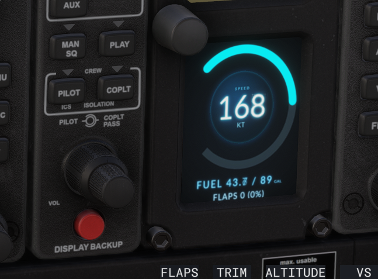

# My Avionics Web Host

A lightweight Express server to preview `MyInstrument.html` in a regular browser outside MSFS. It provides a way to quickly check layout and styling without needing to deploy to MSFS. It also emulates changing values to allow you to observe dynamic behavior, e.g. speed number changing from 1 to characters in length.


> NOTE: This web host is an early prototype intended for quick local layout/styling iteration. Expect breaking changes, missing sim functionality, and minimal hardening. Use with caution; do not rely on it for production or performance validation. Feedback, issues, and suggestions are very welcome.


E.g. The example MyInstrument.html from the tutorial looks like this:


and in MSFS like this:



## Features
- Serves your instrument HTML (configurable) at `/`.
- Serves compiled Rollup output from the parent `build/` directory under `/static`.
- Configurable instrument name and viewport size via a single JSON config, env vars, or CLI args.
- Lightweight SimVar emulation (configurable via `public/simvars.json`).
- Gzip compression + request logging.
- ES Module syntax.

## Prerequisites
Run the build in the project root first so the `build` directory exists:

```
npm run build
```

## Install & Run (Quick Start)
From this `web-host` folder:

```
npm install
npm run start
```

Then open: http://localhost:5173

This will use defaults (instrument `MyInstrument`, size 400x512) unless you create a config or supply overrides.

## Development (auto-reload)
```
npm run dev
```

## Instrument Configuration

You can control which instrument is loaded and the viewport dimensions through a single config resolution chain:

Priority (highest first):
1. CLI flags
2. Environment variables
3. JSON file `instrument.config.json` (at project root `Tutorials/FSAvionics/`)
4. Built-in defaults (`MyInstrument` 400x512)

### 1. JSON Config (recommended)
Create `Tutorials/FSAvionics/instrument.config.json`:

```json
{
	"name": "MyInstrument",
	"width": 400,
	"height": 512
}
```

Rename `name` to match the HTML fragment you have at the project root (e.g. `AltGauge.html`).

### 2. Environment Variables (PowerShell examples)
```
$Env:INSTRUMENT_NAME = 'AltGauge'
$Env:INSTRUMENT_WIDTH = '600'
$Env:INSTRUMENT_HEIGHT = '450'
npm run start
```

Optional: specify a custom config file path
```
$Env:INSTRUMENT_CONFIG = 'custom.config.json'
npm run start
```

### 3. CLI Flags
```
node src/server.js --instrument=AltGauge --width=600 --height=450
node src/server.js -i AltGauge -w 600 -h 450
node src/server.js --config=custom.config.json
```

### 4. What the Server Looks For
- HTML file: `<name>.html` at project root (e.g. `AltGauge.html`).
- Built JS/CSS: `build/<name>.js` and optional `build/<name>.css`.

If the HTML file is missing, a helpful placeholder message is rendered.

### 5. Verifying Config
On startup the console logs resolved name, dimensions, and config file path (or notes if defaults were used).

## SimVar Emulation Config
`public/simvars.json` controls the mock variables and their behavior (random walk, decrement, cycles, derived formulas). If missing, baked-in defaults are used. Edit and hard refresh the page to see changes.

Example snippet:
```json
{
	"intervalMs": 1000,
	"variables": [
		{ "name": "AIRSPEED INDICATED", "unit": "knots", "initial": 110, "randomWalk": { "min": 60, "max": 160, "step": 1.2 } }
	]
}
```

## Adjusting Layout / Styling
Viewport size is enforced by the host frame; update width/height in config/flags to test alternative instrument dimensions quickly.

## Notes
- This host does not fully replicate the MSFS runtime (Coherent calls, full SimConnect, events). It is aimed at rapid UI iteration.
- Treat the SimVar emulator as a visual aid only.
- Expect breaking changes as the prototype evolves.

## License
This web host component is distributed under the repository's root MIT License. See the top-level `LICENSE` file for full terms.
