# Overview
This folder contains sample HTML/JS/CSS instruments for Microsoft Flight Simulator 2024 based on the official tutorial [CREATING AN HTML/JS/CSS INSTRUMENT](https://docs.flightsimulator.com/msfs2024/html/6_Programming_APIs/JavaScript/JS_Gauge_Tutorial/Creating_JS_Instrument.htm)

At the time of writing (Sept 2025), the official tutorial is a bit outdated and incomplete, so this folder contains a more complete and updated version of the tutorial.

# Tutorial of the Tutorial
I recommend following the official tutorial and keep this reference open in another window. The official tutorial is more detailed and explains the concepts better, while this folder contains the complete code and some additional explanations.

## The corrected source code
The tutorial will create a HelloWorld instrument step by step. This is my completed version of the code, which you can compare to the code in the tutorial.

I created my project in ```D:\msfs_dev\TestGauge```
D:\msfs_dev\TestGauge\PackageSources\Copys\mytestgauge\HelloWorldDisplay\helloworld.js

**NOTE the corrected name in registerInstrument**. It must NOT have a space in it, otherwise the gauge will not load.

NB I also changed the name of the ID from "HelloWorldDisplay_ID" to "HelloWorldDisplayID", it not necessary but I prefer not to have underscores in IDs.

```javascript
class HelloWorldDisplay extends BaseInstrument {
    constructor() {
        super();
    }

    get templateID() {
        return "HelloWorldDisplayID";
    }

    Init() {
        super.Init();
    }

    connectedCallback() {
        super.connectedCallback();
        const electricityElement = document.getElementById("Electricity");
                const divElement = document.createElement("div");
                divElement.setAttribute("id", "HelloWorld");
                divElement.innerHTML = "Hello World!";
                electricityElement.appendChild(divElement);
    }
}
registerInstrument("simple-glass-cockpit-sample", HelloWorldDisplay);
```

D:\msfs_dev\TestGauge\PackageSources\Copys\mytestgauge\HelloWorldDisplay\helloworld.html
NB the id change

```html
<script type="text/html" id="HelloWorldDisplayID">
    <div id="Mainframe">
        <div id="Electricity" state="off">
        </div>
    </div>
</script>
<link rel="stylesheet" href="helloworld.css">
<script type="text/html" import-script="/Pages/VCockpit/Instruments/HelloWorldDisplay/helloworld.js">
</script>
```


The css hasn't changed, but here it is for completeness:
D:\msfs_dev\TestGauge\PackageSources\Copys\mytestgauge\HelloWorldDisplay\helloworld.css

```css
#Mainframe {
    width: 100%;
    height: 100%;
    background-color: black;
}

#Electricity {
    width: 100%;
    height: 100%;
}

#HelloWorld {
    width: 100%;
    height: 100%;
    display: flex;
    flex-direction: column;
    justify-content: center;
    align-items: center;
    font-size: 50px;
    background-color: blue;
}
```

## Configuring and Building the Project
The standalone project for the Tutorial is isolated from the demo aircraft, in my case it is D:\msfs_dev\TestGauge. This is the source project that is built and then included into the aircraft example, the aircraft in this case is D:\msfs_dev\DA62. NB There are two samples that reference DA62, one from the sample pack (DA62 Mod) and one that is downloaded directly from the Dev Help menu (DA62), you want the latter. 
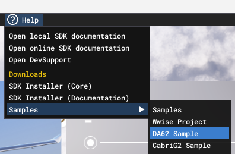

Copy the entire DA62 sample folder to a new folder, e.g. from C:\MSFS 2024 SDK\Samples\DevmodeProjects\SimObjects\Aircraft\DA62 to D:\msfs_dev\DA62. 

The project is built via the Dev menu in MSFS 2024. 

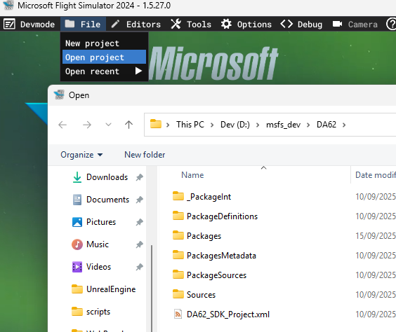

If you have not added the TestGauge project, or need to re-add it, do the following:
Import the TestGauge project's definition into the DA62 project via the import

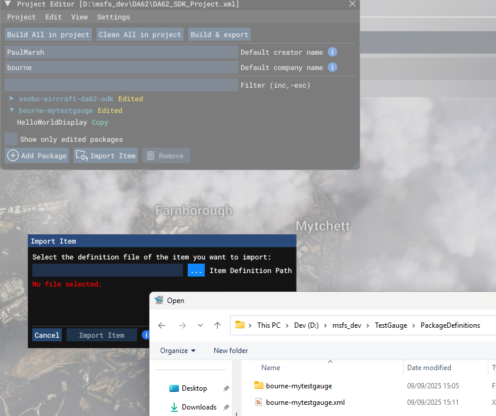

Setup the project via the project Inspector

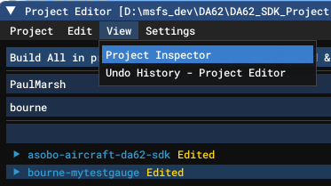

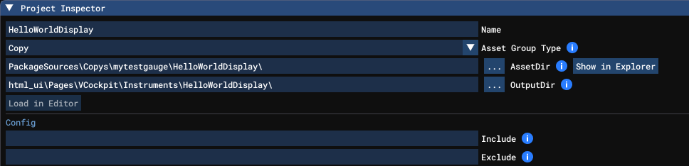

Note the OutputDir needs to that relative path of ```html_ui\Pages\vCockpit\Instruments\<project>```

NB You can access this in the Project Inspector by selecting the nested HelloWorldDisplay project in the Project Explorer.

Configure the Gauge project

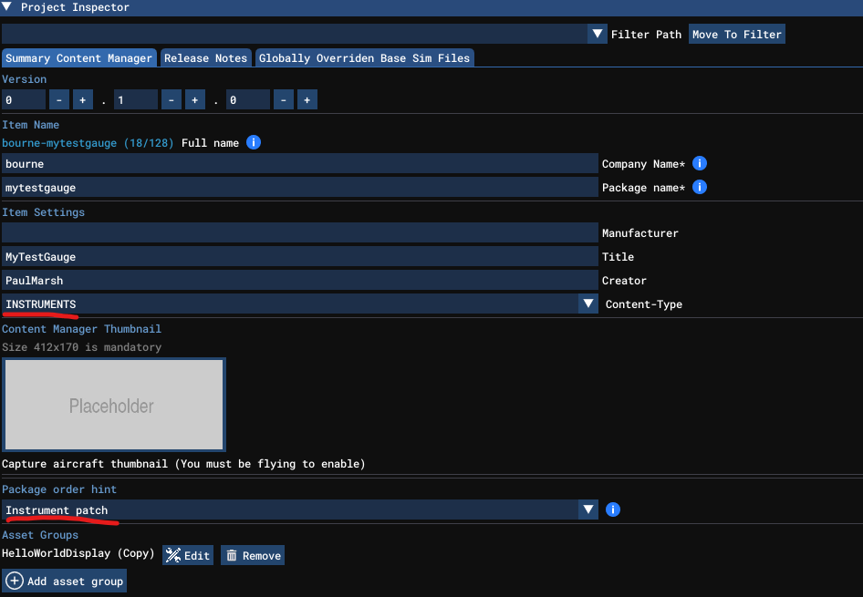

That creates a new folder in the root project with a copy of the gauge project…

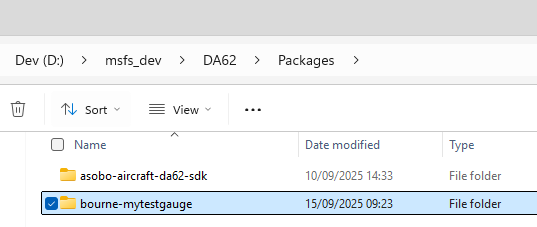

From here on, it appears that you need to make changes from this location, and not in the isolated gauge project. So be careful about getting out of sync!
This has made the new gauge available to the aircraft project (DA62) but to wire it into the cockpit the panel.cfg and panel.xml have to be changed. Going to the root of the DA62 and searching for panel.cfg will find 4 copies, two pairs will be in the Packages and PackagesSources folders. Essentially PackageSources builds the Packages folder. So any changes should be made to the files in PackageSources, which the app will then build and place in the respective Packages folders - i.e. ignore the files in the Packages folder when you want to edit stuff. The remaining choices are in Function_Interior and Function_Exterior. For this demo I want to make changes to the cockpit so Interior is the correct choice. 

```D:\msfs_dev\DA62\PackageSources\SimObjects\Airplanes\DA62_SDK\attachments\asobo\Function_Interior\panel```

Since we're going to hijack the Speed_Display, look for the ini entry containing the texture or htmlguage00 referencing Speed_Display. The Tutorial says it's VCockpit04, not for me. Change the htmlguage00 to point the new gauge…

```ini
[VCockpit02]
size_mm     = 400, 512
pixel_size  = 400, 512
texture     = Speed_Display
htmlgauge00 = HelloWorldDisplay/helloworld.html, 0, 0, 400, 512
```

For now you want the size to remain the same, as we're not changing the 3D Mesh of the cockpit.

Repeat the search for panel.xml, again choosing the one from PackageSources rather than Packages.

```D:\msfs_dev\DA62\PackageSources\SimObjects\Airplanes\DA62_SDK\common\panel\panel.xml```

```xml
<Instrument>
    <Name>HelloWorldDisplayID</Name>
    <Electric>
        <And>
            <Simvar name="CIRCUIT ON:'SpeedBackup'_n" unit="Boolean" />
        </And>
    </Electric>
</Instrument>
```

## Testing the Gauge
To test it out, select Free Flight and change the aircraft, search for DA62…
Select the SDK variant. What this means is the aircraft in the currently active dev project. I.e. if you create 10 copies of DA62 then only the one opened in the Dev Project menu will show here, you won't see 10 copies in the filter. Equally, if you haven't loaded a project then you will NOT see the SDK Sample version as an available option.

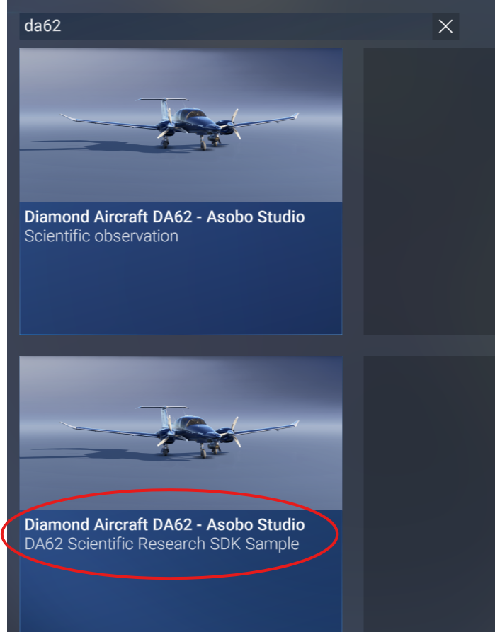

When the flight starts you should see the new instrument. 

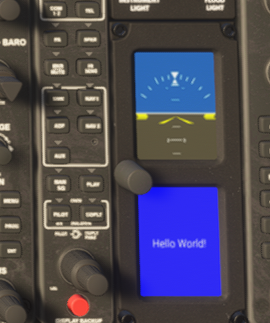

You can confirm this by using the Coherent GT Debugger (GT), which is in the MSFS tools (recommend you pin this)…
```"C:\MSFS 2024 SDK\Tools\CoherentGT Debugger\Debugger.exe"```

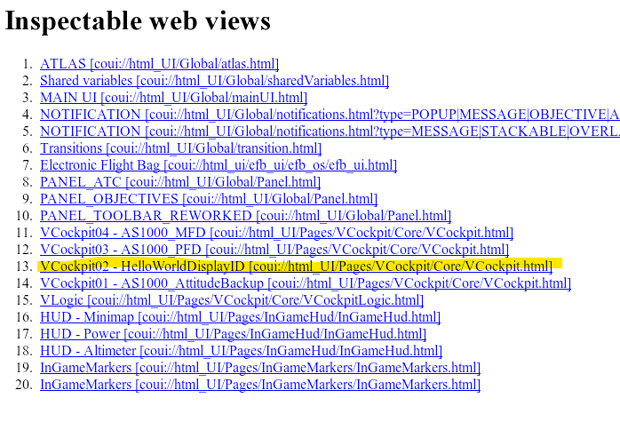

NB If the ID for your gauge is missing and/or all the screen have gone blank, then you probably have an error in the config OR an error in you JS. You can use the GT debugger to check the console for errors. 

Select the gauge link to view the HTML…

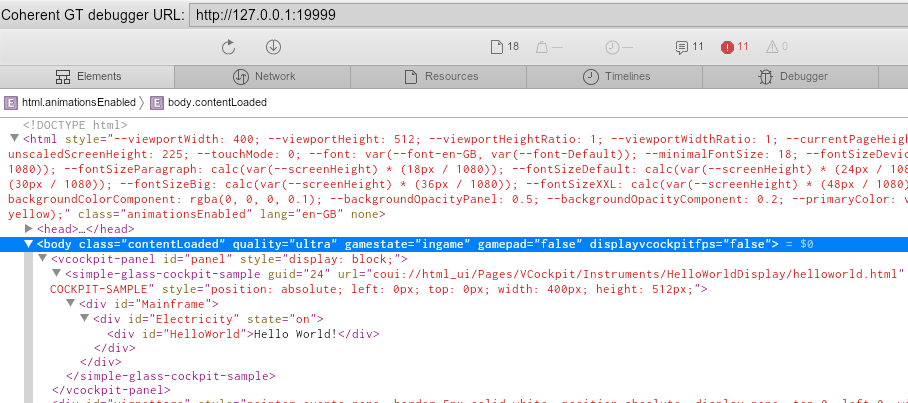

Or Console to check for diagnostics or errors. 

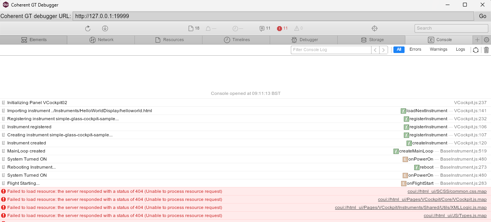

The debugger can be used to set breakpoints. NB If you fail to correctly initialize the JS then the debugger may not attach which can be confusing.

You can make hot changes via the GT tool, but they are not persisted…

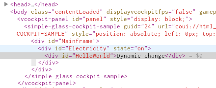

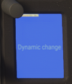

## How to make a persisted change?
With the Flight still running…

This is a bit odd. E.g. as an experiment change the gauge JavaScript in both the source locations, e.g. 
```D:\msfs_dev\DA62\PackageSources\Copys\mytestgauge\HelloWorldDisplay\helloworld.js``` change the message to "A change in DA62"
And in 
```D:\msfs_dev\TestGauge\PackageSources\Copys\mytestgauge\HelloWorldDisplay\helloworld.js```
Change the message to "a change - Gauge"

Now in MSFS Dev, open the DA62 project and select the Gauge sub project. In the Project Inspector select 'Build'. I expected the result would be "a change - Gauge"…

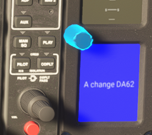

So once the gauge has been imported then it effectively ignores any changes to the original project. Beware!

You do not need to 'End Flight' to rebuild, but you do need to make changes to the now embedded project

NB Also note the Tutorial uses the Electrical system to test controlling the display. This has fundamentally changed in MSFS 2024, so the tutorial is out of date. 
